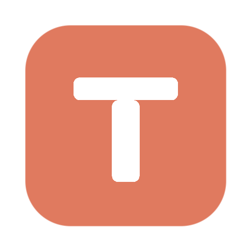
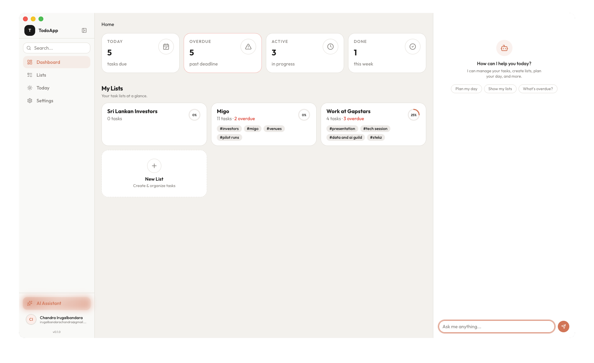

<p align="center">
  
</p>

<h1 align="center">TodoApp</h1>

<p align="center">
  A self-hosted desktop todo application with structured tasks, recurrence, and AI-powered productivity tools.
</p>

<p align="center">
  
  
  
</p>

---

<p align="center">
  
</p>

---

## Overview

TodoApp is a full-featured task management application built as a **Next.js web app wrapped in Electron** with an embedded **SQLite database**. It runs entirely on your machine with no external services required.

Core capabilities:

- **Structured task management** with lists, templates, and instance-based tracking
- **Recurring tasks** with daily, weekly, monthly, and custom schedules
- **AI assistant** powered by OpenAI for task planning, creation, and daily focus
- **Kanban board** with drag-and-drop across status columns
- **Today's Focus** page for daily planning and prioritization
- **Dark mode** with system, light, and dark theme options
- **Cross-platform** builds for macOS, Windows, and Linux

## Architecture

```
+--------------------------+
|    Electron Shell        |
|  (main process)          |
|  - Window management     |
|  - Native menu           |
|  - Cron scheduler        |
|  - Database init         |
+-----------+--------------+
            |
+-----------v--------------+
|  Next.js Standalone      |
|  (child process)         |
|  - App Router pages      |
|  - API routes            |
|  - Server actions        |
|  - Auth.js sessions      |
+-----------+--------------+
            |
+-----------v--------------+
|  SQLite (better-sqlite3) |
|  via Prisma ORM          |
+--------------------------+
```

The Electron main process manages the application lifecycle, starts an embedded Next.js server, and handles cron-based recurring task generation. The Next.js server handles all UI rendering, API routes, and database access through Prisma with a `better-sqlite3` adapter.

## Tech Stack

| Layer | Technology |
|-------|-----------|
| Framework | Next.js 16.1.6 (App Router, standalone output) |
| Desktop | Electron 40.6.0 |
| Database | SQLite via better-sqlite3 + Prisma 7.x |
| UI | React 19, Tailwind CSS 4, shadcn/ui (33 components) |
| Auth | Auth.js v5 (credentials provider, JWT sessions) |
| AI | Vercel AI SDK 6.x + OpenAI |
| Drag & Drop | @dnd-kit |
| Package Manager | Bun |

## Getting Started

### Prerequisites

- [Node.js](https://nodejs.org/) 20+
- [Bun](https://bun.sh/) 1.0+

### Installation

```bash
git clone https://github.com/chandralegend/todo-app.git
cd todo-app
bun install
```

### Environment Setup

Create a `.env` file in the project root:

```env
AUTH_SECRET="generate-a-random-secret-here"
NEXTAUTH_URL="http://localhost:3000"
NEXTAUTH_SECRET="generate-a-random-secret-here"
```

Generate secrets with:

```bash
openssl rand -hex 32
```

### Database Setup

Initialize the SQLite database and apply migrations:

```bash
bunx prisma migrate deploy
```

Optionally seed with demo data (5 lists, 42 tasks):

```bash
npx tsx ./prisma/seed.ts
```

> **Note:** The seed script must run with `npx tsx`, not `bun`, because `better-sqlite3` native modules require the Node.js runtime.

Default seed credentials: `alice@example.com` / `password123`

### Running in Development

**Web only (Next.js):**

```bash
bun run dev
```

**Desktop (Electron + Next.js):**

```bash
bun run electron:dev
```

This starts the Next.js dev server, waits for port 3000, then launches the Electron window.

Open [http://localhost:3000](http://localhost:3000) for the web version, or use the Electron window.

## Desktop Builds

### Local Build

Build a production Electron app for your current platform:

```bash
bun run electron:build
```

Output is written to `release/<version>/`. On macOS, this produces a `.dmg` installer.

> **Important:** After running `electron:build`, the `better-sqlite3` native module is rebuilt for Electron's Node ABI. To restore dev mode, run: `npm rebuild better-sqlite3`

### Preview Mode

Build and run the production app without packaging:

```bash
bun run electron:preview
```

### CI/CD Releases

The project includes GitHub Actions workflows for automated multi-platform builds:

- **CI** (`.github/workflows/ci.yml`): Runs lint and build on every push to `main` and on pull requests.
- **Release** (`.github/workflows/release.yml`): Triggered by `v*` tag push or manual dispatch. Builds for all platforms in parallel and creates a draft GitHub Release.

**Release targets:**

| Platform | Format | Architecture |
|----------|--------|-------------|
| macOS | DMG, ZIP | arm64 (Apple Silicon), x64 (Intel) |
| Windows | NSIS installer | x64 |
| Linux | AppImage, deb | x64 |

**To create a release:**

```bash
# Tag and push
git tag -a v0.3.0 -m "v0.3.0"
git push origin main --tags
```

Or trigger manually from the GitHub Actions tab.

## Docker (Web Only)

For running the web version without Electron:

```bash
docker compose up -d
```

This starts a PostgreSQL database and the Next.js app on port 3000. The Docker deployment uses PostgreSQL instead of SQLite.

## Project Structure

```
todo-app/
  app/                        # Next.js App Router
    api/                      # API routes (auth, chat, cron, health, settings)
    admin/recurrence/         # Recurrence admin page
    lists/                    # List and task management pages
    today/                    # Today's Focus page
    settings/                 # Settings page
    login/ register/          # Auth pages
    design/                   # Component showcase
  components/
    ai/                       # Chat sidebar, tool UI cards
    dashboard/                # Dashboard content and skeleton
    layout/                   # AppShell, TopBar, Footer
    lists/                    # List view, kanban board, task edit, quick add
    settings/                 # Settings tabs
    today/                    # Today's Focus content
    ui/                       # Primitives (BentoCard, CircularDate, ProgressRing, etc.)
  electron/
    main.ts                   # Electron main process
    server.ts                 # Embedded Next.js server launcher
    database.ts               # SQLite database management
    cron.ts                   # Recurring task scheduler
    menu.ts                   # Native application menu
    preload.ts                # Context bridge for renderer
    migrate.mjs               # Lightweight SQL migration runner
    prepare-standalone.mjs    # Standalone output preparation
  lib/
    ai/                       # AI system prompt, tools, task context
    auth.ts                   # Auth.js configuration
    prisma.ts                 # Prisma client with SQLite adapter
    settings.ts               # App settings helpers
    recurrence.ts             # Recurrence generation engine
    task-status.ts            # Status transition rules
    permissions.ts            # List permission checks
    array-fields.ts           # JSON array serialization (SQLite)
  prisma/
    schema.prisma             # Database schema
    migrations/               # SQL migrations
    seed.ts                   # Demo data seeder
  build/                      # App icons (icns, ico, png)
  .github/workflows/          # CI and Release workflows
```

## Features

### Task Management

- Create and organize tasks in lists
- Set importance levels (Low, Medium, High, Critical)
- Track status through a defined lifecycle: Draft -> Todo -> In Progress -> Completed/Failed
- Tag tasks with free-text labels
- Filter by status, importance, due date, and tags
- Sort by deadline, importance, or creation date

### Recurring Tasks

- Configure daily, weekly, monthly, or custom recurrence schedules
- Automatic instance generation via cron (hourly in Electron, configurable for web)
- Each occurrence creates an independent task instance with snapshot fields
- Idempotent generation with database constraints to prevent duplicates

### Views

- **List view**: Filterable, sortable task cards with circular date indicators
- **Kanban board**: Drag-and-drop across 5 status columns with color-coded backgrounds
- **Today's Focus**: Daily planning page with completion tracking
- **Dashboard**: Overview with stats, progress rings, and list cards

### AI Assistant

An AI-powered chat sidebar (requires an OpenAI API key, configured in Settings > AI):

- View and search across all lists and tasks
- Create new lists and tasks through conversation
- Update task statuses with validation
- Plan your day with interactive Accept/Reject suggestions
- Add tasks to Today's Focus

The assistant has access to 11 tools for reading, displaying, and mutating task data.

### Settings

- **Appearance**: Dark mode toggle (system/light/dark), cursor effect toggle
- **AI**: OpenAI API key management (stored in database, not `.env`)
- **Database**: Local/Cloud mode toggle
- **Account**: Password change

## Data Model

The application uses a **Template + Instance** pattern for tasks:

- **TaskTemplate**: Defines the task (description, importance, tags, recurrence rule)
- **TaskInstance**: A specific occurrence of a task (snapshot of template fields at creation time, own status lifecycle)

This design preserves history when templates are edited and supports recurring tasks where each occurrence is tracked independently.

### Key Models

| Model | Purpose |
|-------|---------|
| `User` | Authentication and ownership |
| `TaskList` | Organizes tasks into groups |
| `TaskTemplate` | Task definition with optional recurrence |
| `TaskInstance` | Individual task occurrence with status tracking |
| `RecurrenceRule` | Schedule configuration (frequency, interval, days) |
| `DailyFocus` | Today's Focus task assignments |
| `AppSetting` | Key-value application settings |
| `RecurrenceRunLog` | Audit log for recurrence generation runs |

## API Routes

| Route | Method | Purpose |
|-------|--------|---------|
| `/api/auth/[...nextauth]` | GET, POST | Auth.js authentication endpoints |
| `/api/auth/register` | POST | User registration |
| `/api/auth/change-password` | POST | Password change |
| `/api/chat` | POST | AI chat streaming endpoint |
| `/api/cron/recurrence` | GET, POST | Trigger recurrence generation |
| `/api/health` | GET | Health check with database ping |
| `/api/settings` | GET, PUT | Application settings CRUD |
| `/api/lists/[id]/members` | GET, POST | List membership (groundwork) |

## Scripts Reference

| Script | Description |
|--------|-------------|
| `bun run dev` | Start Next.js development server |
| `bun run build` | Production Next.js build |
| `bun run lint` | Run ESLint |
| `bun run electron:dev` | Development mode with Electron + Next.js |
| `bun run electron:build` | Full production Electron build with packaging |
| `bun run electron:preview` | Build and run production app without packaging |
| `bun run electron:compile` | Compile Electron TypeScript via esbuild |
| `npx tsx ./prisma/seed.ts` | Seed database with demo data |
| `bunx prisma migrate deploy` | Apply pending database migrations |
| `bunx prisma studio` | Open Prisma Studio database browser |

## Contributing

1. Fork the repository
2. Create a feature branch: `git checkout -b feat/my-feature`
3. Commit with conventional tags: `[feat]`, `[fix]`, `[refactor]`, `[docs]`, `[style]`, `[test]`, `[chore]`
4. Ensure `bun run lint` and `bun run build` pass
5. Open a pull request

## License

MIT
